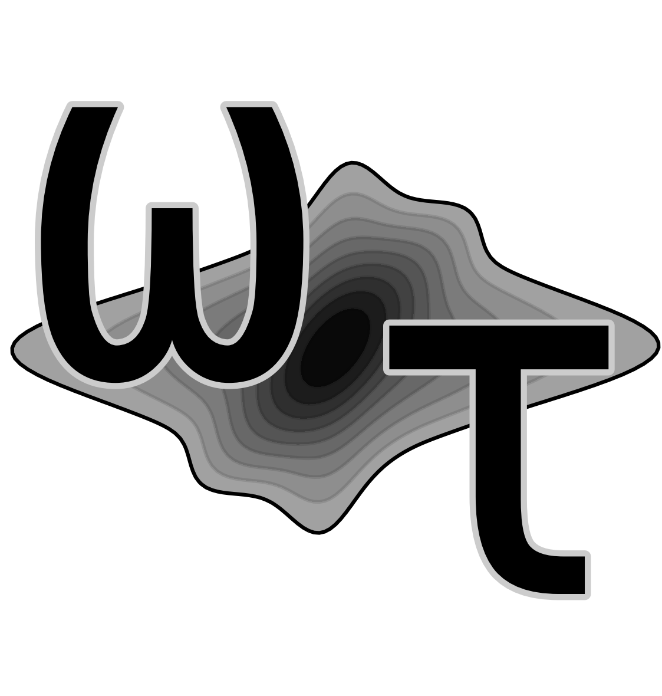

WrightTools
-----------

Tools for loading, processing, and plotting multidimensional spectroscopy data.

Documentation at `wright.tools <http://wright.tools>`_.

.. image:: https://anaconda.org/conda-forge/wrighttools/badges/version.svg
   :target: https://anaconda.org/conda-forge/wrighttools

.. image:: https://badge.fury.io/py/WrightTools.svg
   :target: https://badge.fury.io/py/WrightTools

.. image:: https://readthedocs.org/projects/wrighttools/badge/?version=latest
   :target: http://wright.tools/en/latest/?badge=latest
   :alt: Documentation Status
