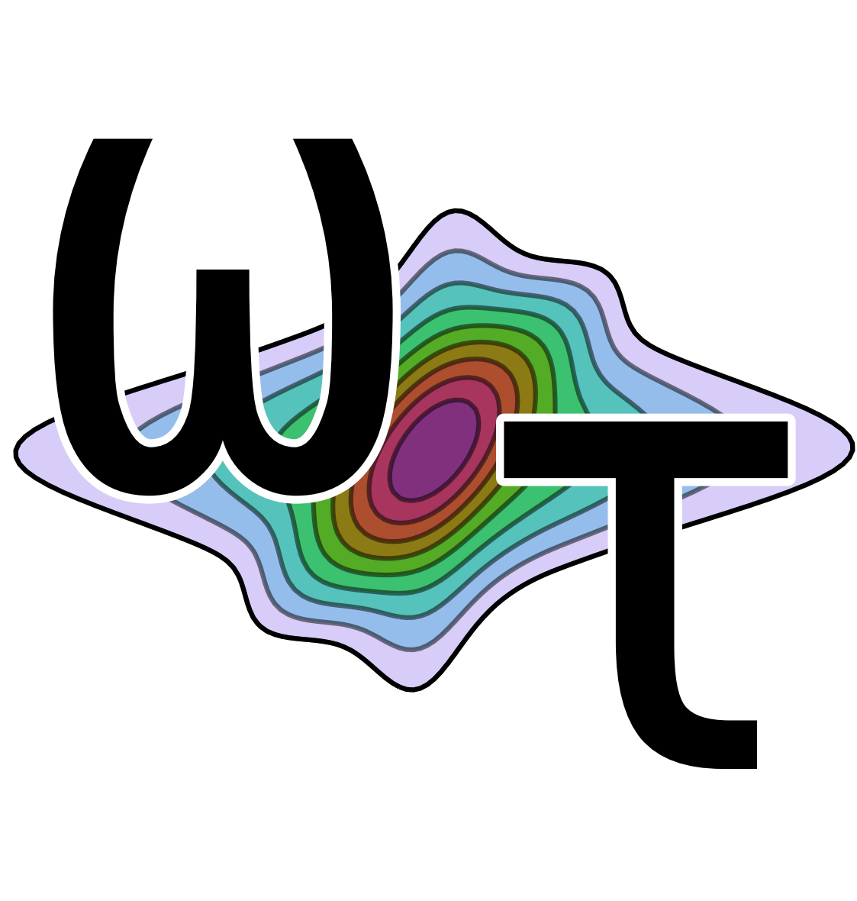

``WrightTools`` loads, processes, and plots multidimensional spectroscopy data.

"Multidimensional spectroscopy" (MDS) is a family of diverse analytical techniques that record the response of a material to multiple stimuli---typically multiple ultrafast pulses of light.
Due to its diversity and dimensionality, MDS data is challenging to process and visualize.
``WrightTools`` is a freely available and openly licensed Python package that is made specifically for multidimensional spectroscopy.
It aims to be a core toolkit that is general enough to handle all MDS datasets and processing workloads.
Being built for and by MDS practitioners, ``WrightTools`` has an intuitive, high-level, object-oriented interface for spectroscopists.

For a more complete introduction to WrightTools, please refer to our short three-page paper in the Journal of Open Source Software:
.. image:: http://joss.theoj.org/papers/10.21105/joss.01141/status.svg
   :target: https://doi.org/10.21105/joss.01141

Status
------

+-------------------+-------------------+
| **PyPI**                              |
+-------------------+-------------------+
+ version           | |pypi-version|    |
+-------------------+-------------------+
| **conda-forge**                       |
+-------------------+-------------------+
| version           | |conda-version|   |
+-------------------+-------------------+
| status            | |cf-noarch|       |
+-------------------+-------------------+
| **Read the Docs**                     |
+-------------------+-------------------+
| stable            | |rtd-stable|      |
+-------------------+-------------------+
| latest            | |rtd-latest|      |
+-------------------+-------------------+

Contents
--------

.. toctree::
   :maxdepth: 2

   install
   quickstart
   data
   collection
   artists
   units
   datasets
   contributing
   wt5
   api/modules
   auto_examples/index
   citation
   alternatives
.. fit
.. diagrams

Index
-----

* :ref:`genindex`
* :ref:`modindex`
* :ref:`search`

.. |cf-noarch| image:: https://circleci.com/gh/conda-forge/wrighttools-feedstock.svg?style=shield
    :target: https://circleci.com/gh/conda-forge/wrighttools-feedstock

.. |conda-version| image:: https://anaconda.org/conda-forge/wrighttools/badges/version.svg
   :target: https://anaconda.org/conda-forge/wrighttools

.. |pypi-version| image:: https://badge.fury.io/py/WrightTools.svg
   :target: https://badge.fury.io/py/WrightTools

.. |rtd-latest| image:: https://readthedocs.org/projects/wrighttools/badge/?version=latest
   :target: http://wright.tools/en/latest/?badge=latest

.. |rtd-stable| image:: https://readthedocs.org/projects/wrighttools/badge/?version=stable
   :target: http://wright.tools/en/stable/?badge=stable
